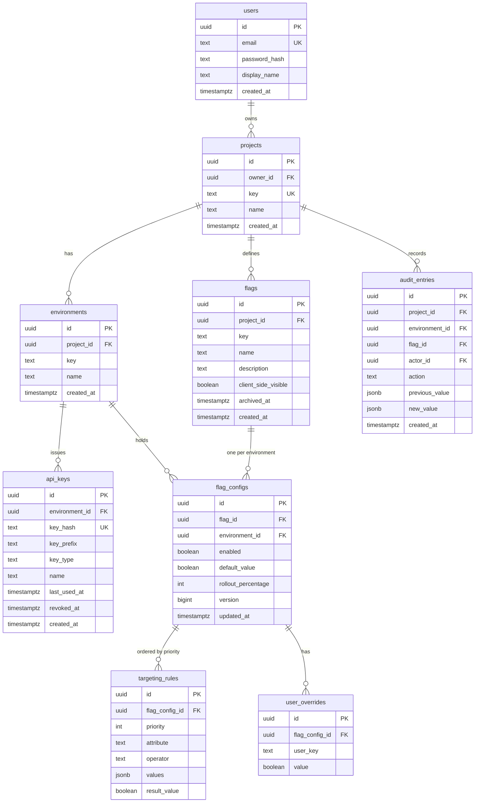

# Database design

PostgreSQL 16. Forward-only Flyway migrations in `backend/src/main/resources/db/migration`.
Never edit an applied migration; add a new one.

## Entity relationship diagram

## Constraints that carry meaning

Each of these encodes a requirement. They exist so that a bug in service code cannot produce
invalid data.

| Constraint | Enforces |
| --- | --- |
| `projects.key` unique | FR-PRJ-002 |
| `environments (project_id, key)` unique | FR-ENV-002 |
| `flags (project_id, key)` unique | FR-FLG-001 |
| `flag_configs (flag_id, environment_id)` unique | Exactly one configuration per environment |
| `flag_configs.rollout_percentage` check 0–100 | FR-FLG-006; percentage is an integer |
| `targeting_rules (flag_config_id, priority)` unique deferrable | FR-RUL-004; reordering happens in one transaction, so uniqueness is checked at commit |
| `user_overrides (flag_config_id, user_key)` unique | FR-RUL-001 |
| `api_keys.key_hash` unique | FR-KEY-002 |
| `api_keys.key_type` check in (`server`, `client`) | FR-KEY-001 |
| No update or delete grant on `audit_entries` | FR-AUD-002 |

`flags.archived_at` rather than deletion (FR-FLG-005): an audit trail referencing a deleted flag
is worthless, and a deleted flag key can be recreated with different meaning.

## Indexes

| Index | Purpose |
| --- | --- |
| `api_keys (key_hash)` | Authentication on every SDK request |
| `flag_configs (environment_id)` | Cache rebuild loads one environment at a time |
| `targeting_rules (flag_config_id, priority)` | Rules loaded in priority order |
| `user_overrides (flag_config_id, user_key)` | Override lookup during rebuild |
| `audit_entries (project_id, created_at desc)` | Audit trail, newest first |
| `audit_entries (flag_id, created_at desc)` | Per-flag history |

The evaluation path uses none of these, because it never touches the database. They serve the
management API and the cache rebuild.

## Types

- `uuid` primary keys, generated in application code so an entity is complete before insert.
- `timestamptz` everywhere. Never `timestamp`. All values stored in UTC.
- `jsonb` for `targeting_rules.values` and audit payloads. Rule values are heterogeneous, and
  audit payloads must record the shape of whatever changed.
- `boolean` for flag values in v0.x. Multivariate flags would replace this with a variation
  table; that migration is anticipated but not built.

## Migration plan

| Migration | Contents |
| --- | --- |
| `V1__baseline.sql` | All tables, constraints and indexes above |
| `V2__audit_append_only.sql` | Revoke update and delete on `audit_entries` from the application role |

Later migrations are added as features land. Every migration is reversible by a forward
migration, never by editing.

## Seed data

`backend/src/test/resources/fixtures/` holds a deterministic dataset used by both the Java and
TypeScript test suites: one project, three environments, and flags exercising every branch of the
resolution order. Because both implementations assert against the same fixtures, a divergence
between server and SDK evaluation shows up as a test failure rather than a production incident.
