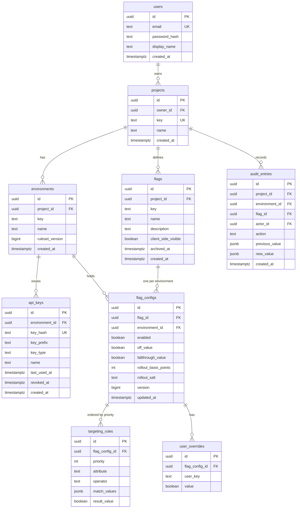

# Database design

PostgreSQL 16. Forward-only Flyway migrations in `backend/src/main/resources/db/migration`.
Never edit an applied migration; add a new one.

## Entity relationship diagram



`match_values`, not `values`: `values` is a reserved word in SQL and would have to be
double-quoted in every statement and mapped as `@Column(name = "\"values\"")` in the entity.

## Ruleset version

`environments.ruleset_version` is a monotonically increasing counter, bumped in the same
transaction as any write that changes what the environment serves: a configuration change, a rule
or override replacement, a flag creation, a visibility change, an archive or a restore.

It is the source of the ETag on `GET /sdk/config` and of the version in the SSE change event. Both
were specified before this column existed, with nothing behind them: `flag_configs.version` is a
per-row counter and cannot answer "has this environment changed".

The ETag is derived from `(ruleset_version, key_type)`, never from the version alone, because a
server key and a client key receive different bodies from the same URL at the same version. See
`docs/API.md` for the cache headers that go with it.

## Key format

`api_keys.key_prefix` needs the format it is a prefix of to be defined. It is:

```
flg_srv_<43 characters>     server key
flg_cli_<43 characters>     client key
```

- The random part is 32 bytes (256 bits) from a CSPRNG — `java.security.SecureRandom` — encoded
  base64url without padding, which is 43 characters.
- `key_prefix` stores the first 16 characters: the type marker plus the first 8 characters of the
  random part. It is not a secret, it is what the dashboard displays next to a key so a human can
  tell two keys apart, and 8 characters of base64url is enough to make a collision within one
  account unrealistic.
- `key_hash` stores the SHA-256 of the whole key, hex-encoded.

The entropy is what makes ADR-007's choice of SHA-256 over bcrypt correct. A fast hash is the
right tool for a 256-bit random value and the wrong tool for anything a human chose; the argument
depends on this format, so the format is specified here rather than left to the implementation.

The type marker in the key is a convenience for humans and for secret scanners. It is never
trusted: key type comes from the database row, not from the string the caller sent.

## Key format for projects, environments and flags

```
^[a-z0-9](?:[a-z0-9-]{0,61}[a-z0-9])?$
```

Applied as a CHECK to `projects.key`, `environments.key`, `flags.key` and
`flag_configs.rollout_salt`. FR-PRJ-001 requires URL-safe keys and this is trivially expressible,
so it is expressed. The character set excludes `:`, which matters beyond aesthetics: the bucket
hash input is `rolloutSalt + ":" + userKey`, and without the exclusion a salt of `a:b` with user
`c` would hash identically to a salt of `a` with user `b:c`.

## Constraints that carry meaning

Each of these encodes a requirement. They exist so that a bug in service code cannot produce
invalid data. Where a requirement is *not* enforceable declaratively, it says so rather than
implying otherwise.

| Constraint | Enforces |
| --- | --- |
| `projects.key` unique | FR-PRJ-002, uniqueness half |
| `projects` before-update trigger rejecting a changed `key` | FR-PRJ-002, immutability half |
| `environments (project_id, key)` unique | FR-ENV-002 |
| `flags (project_id, key)` unique | FR-FLG-001 |
| `flags` before-update trigger rejecting a changed `key` | FR-FLG-002 |
| `projects.key`, `environments.key`, `flags.key`, `flag_configs.rollout_salt` format check | FR-PRJ-001, FR-EVL-002 |
| `flag_configs (flag_id, environment_id)` unique | Exactly one configuration per environment |
| `flag_configs.rollout_basis_points` check 0–10000 | ADR-011; the rollout is an integer count of basis points |
| `flag_configs.off_value` check `= false` | FR-EVL-001; the kill switch is unconditional in v0.x |
| `targeting_rules (flag_config_id, priority)` unique | FR-RUL-004, uniqueness half |
| `targeting_rules.operator` check against the operator vocabulary | FR-RUL-003 |
| `user_overrides (flag_config_id, user_key)` unique | FR-RUL-001 |
| `api_keys.key_hash` unique | Two keys cannot collide into one identity |
| `api_keys.key_type` check in (`server`, `client`) | FR-KEY-001 |
| `audit_entries.action` check against the action vocabulary | FR-AUD-001 |
| `audit_entries` before update-or-delete and before truncate triggers, plus revoked grants | FR-AUD-002 |

Not enforced by the database, and enforced in service code with a repository test instead:

- **Contiguity of rule priorities** (FR-RUL-004). Uniqueness is a constraint; "0 to n−1 with no
  gaps" is an aggregate over the group and needs a deferred constraint trigger. Rules are replaced
  as a whole list in one transaction (`PUT .../rules`), so the service assigns priorities from 0
  and a repository test asserts the result. Nothing in the evaluation order needs gap-free
  priorities, only a stable total order, so this is a tidiness invariant rather than a
  correctness one.

The unique constraint on `targeting_rules (flag_config_id, priority)` is **not** deferrable. It
was specified as deferrable to allow in-place priority swaps, which the API forbids anyway: rules
are replaced wholesale, and a delete-all-then-insert-all in one transaction never holds a duplicate
priority at any instant. Deferrability would have cost real things — `ON CONFLICT` cannot use a
deferrable constraint as its arbiter, so no upserts on the table ever, and violations surface as
`TransactionSystemException` at commit rather than `DataIntegrityViolationException` at the
statement, outside the `@Transactional` method where a service could map them to a clean 409.

`flags.archived_at` rather than deletion (FR-FLG-005): an audit trail referencing a deleted flag
is worthless, and a deleted flag key can be recreated with different meaning. The uniqueness
constraint applies to archived rows too, so an archived key cannot be reused — deliberate, and
stated in FR-FLG-005 so the dashboard does not have to discover it at runtime.

## Audit immutability

`audit_entries` is append-only, and the revoke on its own does not achieve that:

- If Flyway and the application share one role — the default — that role owns the table, and an
  owner can `GRANT` the privilege back to itself.
- `TRUNCATE` is a separate privilege from `DELETE`. So is `DROP`.
- `PostgreSQLContainer`'s default user is a superuser and bypasses privilege checks entirely, so
  suite 10 could not have passed as written.

So: a `BEFORE UPDATE OR DELETE` trigger on `audit_entries` that raises an exception, **plus** the
revokes. The trigger holds regardless of role, ownership or superuser status, which is what makes
the suite 10 assertion meaningful. A row-level trigger does not fire on `TRUNCATE`, so a second,
statement-level `BEFORE TRUNCATE` trigger raises the same exception; without it the owning role
could empty the table in one statement that the first trigger never sees.

Two roles, in compose, in deployment and in the Testcontainers fixture. Roles and their passwords
are provisioned by the environment — `docker/postgres/init-roles.sh` for Compose and the fixture,
the hosting provider's tooling for a managed database — and never by a migration, because a
migration is source and source carries no credentials (ADR-016). Migrations grant privileges to
roles that already exist.

| Role | Holds | Used by |
| --- | --- | --- |
| `flaglane_migrator` | Owns the schema, runs DDL | Flyway, at startup only |
| `flaglane_app` | `SELECT`, `INSERT`, `UPDATE`, `DELETE` on tables it needs; no `UPDATE`, `DELETE` or `TRUNCATE` on `audit_entries`; no DDL | The running application |

## Nullability

Every column is `NOT NULL` except these, and each nullable column means something specific:

| Column | Null means |
| --- | --- |
| `users.display_name` | Not supplied at registration |
| `flags.description` | Not supplied |
| `flags.archived_at` | Not archived |
| `api_keys.last_used_at` | Never used |
| `api_keys.revoked_at` | Not revoked |
| `audit_entries.environment_id` | The event is not environment-scoped: project or flag creation |
| `audit_entries.flag_id` | The event is not flag-scoped: project, environment or key events |
| `audit_entries.previous_value` | A creation; there was no previous state |
| `audit_entries.new_value` | A deletion or revocation; there is no new state |

`audit_entries.environment_id` and `flag_id` are nullable because FR-AUD-001 covers every mutation
and half of them have no environment or no flag — project creation has neither, key creation has
no flag. This weakens the `(flag_id, created_at desc)` index for project-level events, which is
correct: those are read through the project index.

`flag_configs.version` is `NOT NULL DEFAULT 1`. It is a row version for optimistic locking, not
the ruleset version.

## Foreign keys and deletion

| Foreign key | On delete |
| --- | --- |
| `projects.owner_id → users` | `RESTRICT` |
| `environments.project_id → projects` | `CASCADE` |
| `flags.project_id → projects` | `CASCADE` |
| `api_keys.environment_id → environments` | `CASCADE` |
| `flag_configs.flag_id → flags` | `CASCADE` |
| `flag_configs.environment_id → environments` | `CASCADE` |
| `targeting_rules.flag_config_id → flag_configs` | `CASCADE` |
| `user_overrides.flag_config_id → flag_configs` | `CASCADE` |
| `audit_entries.project_id → projects` | `RESTRICT` |
| `audit_entries.actor_id → users` | `RESTRICT` |
| `audit_entries.environment_id → environments` | `SET NULL` |
| `audit_entries.flag_id → flags` | `SET NULL` |

The audit log outlives what it describes. Deleting an environment blanks the reference and keeps
the entry; deleting a project is impossible while its audit trail exists, which in v0.x means
impossible, because there is no project deletion endpoint. Flags are archived rather than deleted,
so the `SET NULL` on `flag_id` is a backstop, not a path anything takes.

## Audit action vocabulary

`audit_entries.action` is constrained to this list. It was previously unbounded, which makes an
audit trail unqueryable and a `CHECK` unwritable.

```
project.created        environment.created    environment.deleted
flag.created           flag.updated           flag.archived        flag.restored
config.updated         rules.replaced         overrides.replaced
key.created            key.revoked
```

Adding an action is a migration. That is the point: the vocabulary is part of the contract with
anyone reading the log.

## Indexes

| Index | Purpose |
| --- | --- |
| `flag_configs (environment_id)` | Cache rebuild loads one environment at a time |
| `audit_entries (project_id, created_at desc, id desc)` | Audit trail, newest first, keyset paginated |
| `audit_entries (flag_id, created_at desc, id desc)` | Per-flag history |

The unique constraints on `api_keys (key_hash)`, `targeting_rules (flag_config_id, priority)` and
`user_overrides (flag_config_id, user_key)` already create indexes; they were previously listed a
second time here as if they were separate objects.

Neither the evaluation engine nor a served `/sdk/**` request touches any of these. The engine is a
pure function over an in-memory ruleset, and key authentication is served from an in-memory key
cache (FR-KEY-007) rather than by looking up `key_hash` per request — which is what lets
"database down, serving continues" be true rather than aspirational. These indexes serve the
management API, the cache rebuild, and the key cache's own load.

## Types

- `uuid` primary keys, generated in application code so an entity is complete before insert.
- `timestamptz` everywhere. Never `timestamp`. All values stored in UTC.
- `jsonb` for `targeting_rules.match_values` and audit payloads. Rule values are heterogeneous
  within the types FR-RUL-006 permits, and audit payloads must record the shape of whatever
  changed.
- `boolean` for flag values in v0.x. Multivariate flags would replace this with a variation
  table; that migration is anticipated but not built.

## Migration plan

| Migration | Contents |
| --- | --- |
| `V1__baseline.sql` | All tables, constraints, triggers and indexes above |
| `V2__roles.sql` | Grants to `flaglane_app`, and the revokes on `audit_entries`. The role itself is provisioned by the environment before Flyway runs (ADR-016) |
| `V3__audit_append_only.sql` | The `BEFORE UPDATE OR DELETE` row trigger and the `BEFORE TRUNCATE` statement trigger on `audit_entries` |

Later migrations are added as features land. Every migration is reversible by a forward
migration, never by editing.

## Seed data

`backend/src/test/resources/fixtures/` holds a deterministic dataset used by both the Java and
TypeScript test suites: one project, three environments, and flags exercising every branch of the
resolution order. Because both implementations assert against the same fixtures, a divergence
between server and SDK evaluation shows up as a test failure rather than a production incident.

The fixtures include, deliberately, the cases where two reasonable implementations diverge: user
keys containing non-ASCII characters and `:`, a rule against an attribute the context does not
carry, a `NOT_EQUALS` against an absent attribute, `1` compared with `"1"`, two flags sharing a
rollout salt, and a disabled configuration whose `fallthroughValue` is `true`.
